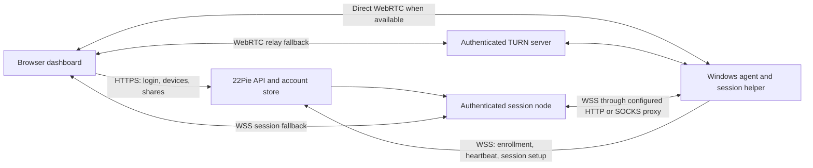

# 22Pie architecture for DWService parity

Status: proposed implementation design from the 2026-09-12 audit. This document does not deploy services, change ports, enable unattended access or claim that the components below exist. See [inventory](dwservice-feature-inventory.csv) and [audit](dwservice-parity-audit.md).

## Product and compatibility boundary

Reproduce observable DWService capabilities using Graphics Services branding and an independently managed 22Pie backend. Matching a workflow does not require matching the Python implementation or exposing DWService protocol compatibility. Keep the existing Google VPS and preserve enrolled device identities during migrations. Do not promise that a stock DWAgent can connect to the 22Pie backend.

The published agent is not a complete hosted service. Our own account store, enrollment, session routing, permissions, node management, updates and browser applications are required. Source review in this audit did not copy third-party implementation into the product. Any future reuse needs a per-component license and attribution review; do not globally rename internal identifiers or remove notices.

## Proposed system

These are functional roles. They can initially run on the existing VPS; they do not require several new machines. HBBS/HBBR are not compatible substitutes for either a TURN server or our session node.

### Transport decision

Retain the working WebRTC path as an optimization while adding a complete browser-to-node-to-agent WSS path for restrictive networks. TURN handles WebRTC relay; it does not by itself make the agent's WebRTC implementation use an arbitrary HTTP CONNECT proxy. The WSS fallback must carry screen, input, files and the other authorized applications, not only registration.

Use one transport interface for session-scoped channels. Include protocol version, session ID, capability, message type, sequence, payload length, acknowledgement and cancellation. Enforce size limits and bounded queues at both ends. Prioritize input over bulk transfer, coalesce screen updates, and terminate orphaned sessions. Do not place binary screen or file data in the current small JSON signaling messages.

For the WSS screen fallback, benchmark a native capture plus changed-region JPEG path rendered in the browser, comparable in approach to the reference's native image encoding, against browser-compatible video decoding. Do not commit to WebCodecs-only delivery without browser coverage. It is a separate encoded transport path; renaming WebRTC messages to WebSocket messages will not implement it.

Require certificate verification for HTTPS/WSS, short-lived node tickets bound to owner/device/session/capabilities, and explicit trust of our VPS node. Do not claim end-to-end encryption for a node-terminated WSS design. If end-to-end encrypted fallback is required, authenticated endpoint key exchange and payload encryption need their own design and tests. Never log passwords, proxy credentials, session tickets or file contents.

### Agent components

- Connection manager: direct/system/HTTP/SOCKS configuration, bounded connection and handshake timeouts, proxy authentication, certificate validation, cancellation and reconnection. Explicit proxy policy must apply to update/download paths as well as session traffic.
- Native status/configuration interface: agent identity, connectivity, active sessions, pause, local disconnect, configuration password and explicit unattended setting.
- Optional installed Windows service: start before login, coordinate interactive user sessions, handle logout/reboot, maintain a restricted authenticated IPC channel to a desktop helper. Run-only mode remains available. Existing installations must not silently acquire service persistence.
- Desktop helper: capture and input in the correct Windows session; monitor/DPI mapping; quality controls; clipboard/audio. Respect OS privilege boundaries and support failures visibly. Secure attention must use a supported authorized mechanism.
- Application modules: filesystem, shell, resources, editor and log watch. Every operation rechecks session ownership, permissions and cancellation; screen trust does not authorize another module.
- Update manager: authenticated manifests and artifacts, atomic installation, retained previous version, health check and rollback. Preserve identity and explicit access settings.

### Backend and data

Replace the single environment-configured administrator with a transactional account/device/session store and migrations. Keep the current owner as the initial account, require expiring enrollment authorization for new devices, and preserve existing device keys. A device signature proves possession of its key; it does not prove which user may own that device.

Separate account permissions, per-application share permissions, optional folder restrictions, local unattended policy and current-session approvals. Deny unsupported capabilities. Revocation must reach already-open sessions, not just block future login. Audit metadata belongs in a durable access history with explicit retention; debug logs alone are insufficient.

Introduce a negotiated capability/version manifest so older agents do not display functional controls for features they cannot execute. Feature state in the dashboard must come from actual agent capability and permission checks.

## Deployment sequence on the existing VPS

Current production addresses remain the dashboard on 21118 (3000 compatibility) and API on 21116 (4000 compatibility). Keep them usable while staging changes. First add TLS to the agent build and a verified HTTPS/WSS endpoint. Confirm certificate issuance/renewal and privileged-port service configuration on this VPS before selecting the exact 443 layout; the current SSH account has no passwordless sudo.

Test a new session node and TURN separately before modifying the existing listeners. TURN needs authenticated allocation, an explicit firewall/range plan and tests from a separate network. If TLS web traffic and TURN both need port 443, choose a tested separate-IP or protocol-routing arrangement; two processes cannot independently own the same IP/port. HTTP CONNECT proxy-only operation is validated through the WSS node path.

Every deployment needs configuration backup without secret exposure, database migration backup, old-client compatibility checks and a tested rollback. Do not retire the current route until the replacement passes a real Windows session test.

## Delivery gates

| Phase | Concrete output | Gate before completion |
|---|---|---|
| P0 — reference baseline | Traceable inventory, pinned agent revision, architecture, reference-screen walkthrough | Every visible reference control and documented platform exception is mapped; unknowns stay open |
| P1 — connection foundation | Certificate-verified WSS, owner-bound enrollment, versioned channel protocol, authenticated node, proxy transports and TURN | Complete login/enrollment/screen/file test on LAN, separate networks, UDP-blocked and proxy-only networks; reject invalid tickets/certificates |
| P2 — agent lifecycle | Native monitor, portable and installed modes, explicit unattended switch, service/helper, update/uninstall | Clean Windows install; accept/deny; enable/revoke unattended; lock/logout/reboot; interrupted update; complete uninstall |
| P3 — usable desktop quality | Manual/Auto quality, native-resolution option, zoom, multiple monitors, statistics, capture/encoding optimization | Side-by-side reference tests with text and motion; record CPU, bandwidth, FPS, p50/p95 input latency and visual artifacts |
| P4 — all remote applications | Full file manager, clipboard/audio, shell, resource controls, editor and log follower | Positive and denied operations on real devices; cancellation, disconnect, concurrent updates and path-boundary tests |
| P5 — hosted management | Multi-user accounts, recovery/2FA, groups/shares, audit history, API and hosted-feature discovery closure | Cross-account isolation; expiry/revocation of active shares; account recovery; reference menu coverage |
| P6 — platform parity | Named Linux/macOS/browser support and localization | Actual-device runs per supported OS/browser/architecture; documented exceptions match the reference |

P1 and P3 may have independent implementation work, but a high-quality LAN stream alone cannot pass connection parity. The first Windows release is a milestone, not full DWService parity. No completion percentage should be inferred from the number of rows with code present.

## Measurement and evidence required

For each inventory ID attach the product commit, agent artifact hash, server revision, OS/build, browser/version, privilege level, transport route, steps, expected behavior, actual behavior and evidence location. A Windows CI build is a packaging check, not a screen-sharing result.

Use an authorized test device for lifecycle, shell, file deletion and service-control cases. Proposed performance tests: 1080p and 4K text, scrolling and motion; fast LAN and shaped 2/5/10 Mbps links; added latency and packet loss; direct and forced relay/proxy paths. Compare with the reference on the same machines and network. Choose numeric acceptance thresholds from those measurements, not from a promised FPS the hardware may not achieve.

Regression cases include missing monitor, changed DPI, revoked session during transfer, expired share during terminal use, failed proxy authentication, malformed frame lengths, interrupted updates, stale browser cache, locked desktop and concurrent viewers. Unsupported reference configurations must be explicitly identified; they must not silently reduce our advertised scope.

## Outstanding reference discovery

No authenticated DWService UI or physical reference agent was inspected in this audit. UI-01 tracks the complete account/agent/settings walkthrough; API-01 tracks API details; BIZ-01 retains billing/subscription/settings discovery; EXT-02 retains earlier RustDesk-specific requests. The reference's documentation index is broad, but it cannot prove every runtime behavior. A complete-replica claim remains blocked on closing those discovery rows and passing the implementation tests, not on this document being written.
